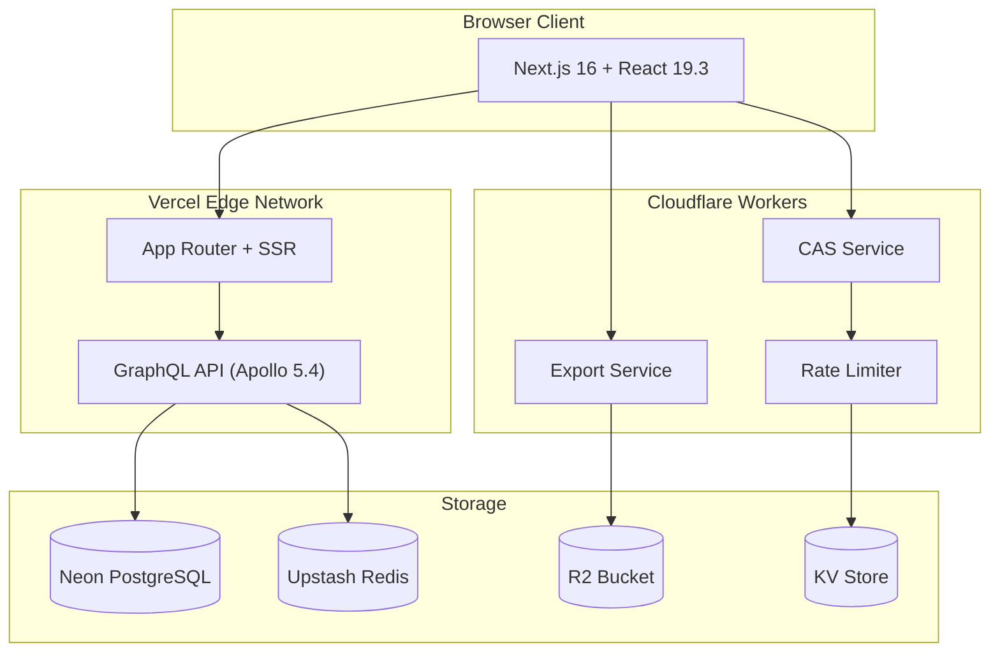
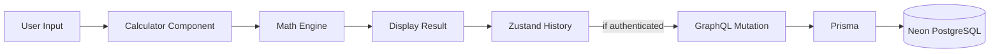
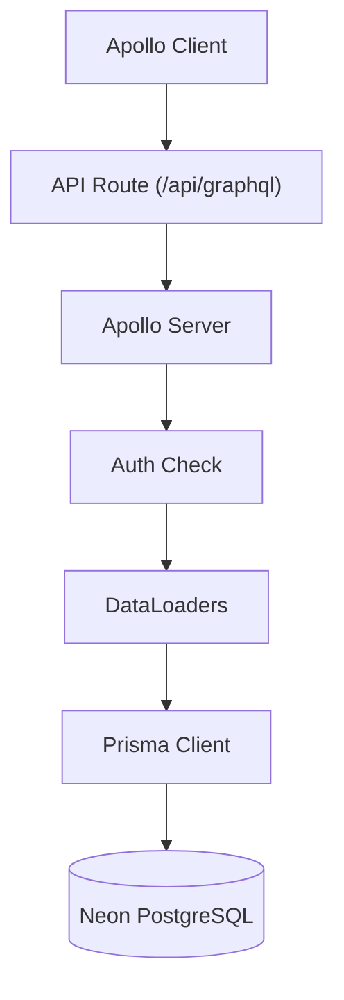
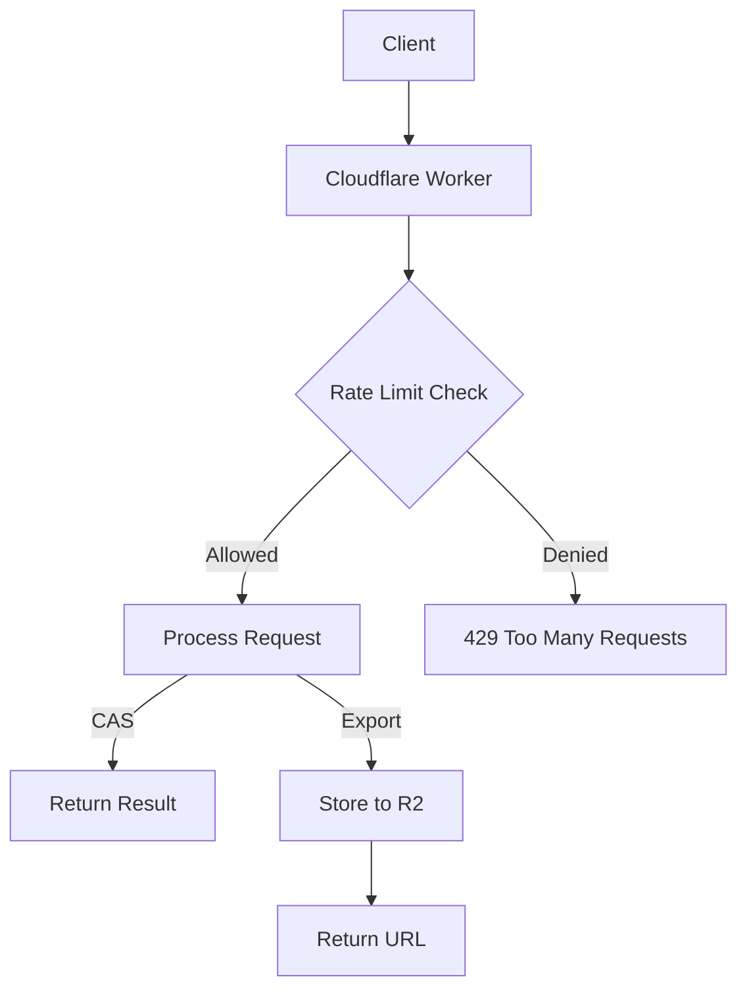

# NextCalc Pro - Architecture

## High-Level Architecture



## Package Dependency Graph

```
@nextcalc/web
  ├── @nextcalc/math-engine
  ├── @nextcalc/plot-engine
  │     └── @nextcalc/math-engine
  ├── @nextcalc/database
  ├── @nextcalc/api
  │     └── @nextcalc/database
  └── @nextcalc/types

@nextcalc/cas-service     (standalone, uses mathjs directly)
@nextcalc/export-service  (standalone, uses mathjax)
@nextcalc/rate-limiter    (standalone, uses Cloudflare KV)
```

Build order enforced by Turborepo:

1. `@nextcalc/types` (no deps)
2. `@nextcalc/math-engine` (depends on mathjs)
3. `@nextcalc/database` (depends on Prisma + Neon adapter)
4. `@nextcalc/plot-engine` (depends on math-engine, Three.js, D3)
5. `@nextcalc/api` (depends on database)
6. `@nextcalc/web` (depends on all above)

## Package Descriptions

### @nextcalc/math-engine

Core mathematical computation library with subpath exports.

| Module | Description | Key Exports |
|--------|-------------|-------------|
| `parser/` | Expression tokenizer and AST builder | `tokenize()`, `parse()`, AST node types |
| `symbolic/` | Symbolic differentiation and integration | `differentiate()`, `integrate()` |
| `matrix/` | Linear algebra operations | `multiply()`, `inverse()`, `eigenvalues()` |
| `solver/` | Equation solving (algebraic + ODE) | `solve()`, `solveODE()` |
| `stats/` | Statistical functions | `mean()`, `stdev()`, `regression()` |
| `units/` | Unit conversion engine | `convert()`, unit definitions |
| `complex/` | Complex number arithmetic | `Complex` class, operations |
| `algorithms/` | Algorithm implementations | graph theory, game theory |
| `fourier/` | FFT, spectral analysis, Fourier series | `fft()`, `ifft()`, `fourierSeries()` |
| `calculus/` | Calculus operations | Taylor series, limits |
| `cas/` | Computer algebra system core | expression simplification |
| `differential/` | Differential equations | ODE/PDE support |
| `knowledge/` | Mathematical knowledge base | formulas, theorems |
| `problems/` | Problem generation | practice problem sets |
| `prover/` | Mathematical proof engine | proof steps, verification |
| `content/` | Educational content | lessons, explanations |
| `wasm/` | WASM arbitrary precision (scaffolded) | `getWASMManager()` (mock fallback) |

**Tech:** Math.js 15.2, TypeScript 6.0, Vitest

### @nextcalc/plot-engine

GPU-accelerated mathematical visualization engine.

| Module | Description |
|--------|-------------|
| `renderers/` | WebGL 2D renderer (<15KB), Three.js 3D renderer (lazy-loaded) |
| `sampling/` | Adaptive function sampling with recursive subdivision |
| `controls/` | Interactive pan, zoom, rotate (mouse, touch, keyboard) |
| `export/` | PNG, SVG, CSV export |
| `types/` | Plot configuration types |

**Tech:** Three.js 0.183.2, D3 7.9.0, WebGL 2, WebGPU (progressive enhancement)

### @nextcalc/database

Shared Prisma 7 database package.

- **Schema:** `packages/database/prisma/schema.prisma` (single source of truth)
- **Config:** `packages/database/prisma.config.ts` (loads env from `apps/web/.env.local` via dotenv)
- **Client:** `packages/database/src/client.ts` (Neon serverless adapter singleton)
- **Generated:** `packages/database/src/generated/prisma/` (gitignored, regenerated on postinstall)

**Tables:** users, accounts, sessions, worksheets, folders, forum_posts, comments, upvotes, audit_logs

**Tech:** Prisma 7.5.0-dev.33, @neondatabase/serverless 1.0.2, @prisma/adapter-neon

### @nextcalc/api

GraphQL API integrated into the Next.js app via route handler.

| Directory | Description |
|-----------|-------------|
| `src/graphql/` | Schema definition, resolvers |
| `src/lib/` | Context, DataLoaders, error handling, validation, subscriptions |

**Key features:**
- Auth is configurable via `setAuthFunction()` -- real NextAuth injected from the web route handler
- 11 DataLoaders for N+1 prevention (userById, folderById, worksheetSharesByWorksheetId, childFoldersByParentId, upvoteCountByTargetId, commentCountByPostId, forumPostById, commentById, repliesByParentCommentId, worksheetsByFolderId, hasUpvoted)
- Resolvers: user, worksheet, folder, calculation, forum, comment, upvote
- Upstash Redis caching in `src/lib/cache.ts` with `invalidateByPrefix` via SCAN
- API package exports source `.ts` files (not dist/) for monorepo dev

**Tech:** Apollo Server 5.4.0, GraphQL 16.13.0, DataLoader 2.2.3, Zod

### @nextcalc/types

Shared TypeScript type definitions used across the monorepo.

**Exports:** `Calculation`, `HistoryEntry`, and other shared interfaces.

### Cloudflare Workers

Three edge microservices deployed to Cloudflare's global network:

| Worker | Purpose | Port (dev) | Bindings |
|--------|---------|-----------|----------|
| cas-service | Symbolic math (solve, differentiate, integrate) | 8787 | -- |
| export-service | LaTeX to PDF/PNG/SVG conversion | 8788 | R2 bucket |
| rate-limiter | API quota enforcement (sliding window) | 8789 | KV namespace |

**Tech:** Hono 4.12.3, Wrangler 4.69.0, Zod

## Data Flow

### Client-Side Calculation



### Server-Side (GraphQL)



### Edge Worker Flow



## Authentication Flow

```
1. User clicks "Sign in with Google/GitHub"
2. NextAuth redirects to OAuth provider
3. Provider redirects back to /api/auth/callback/[provider]
4. NextAuth creates/updates User + Account in database
5. JWT session token set as HTTP-only cookie
6. Subsequent requests include session automatically
7. API resolvers check session via auth() function
```

**Providers:** Google OAuth 2.0, GitHub OAuth
**Strategy:** JWT (stateless, 30-day expiry)
**Adapter:** @auth/prisma-adapter for database persistence
**Important:** Only providers with configured credentials are registered (conditional push in `auth.config.ts`)

## Styling System

### OKLCH Color Architecture

Colors are defined in `apps/web/app/globals.css` using the OKLCH color space (P3 gamut, perceptually uniform):

```css
@theme {
  --color-background: oklch(1 0 0);
  --color-foreground: oklch(0.145 0 0);
  --color-primary: oklch(0.205 0.006 286.029);
  /* ... */
}
```

### Design System Layers

1. **CSS Custom Properties** -- OKLCH color tokens in `globals.css`
2. **Tailwind 4** -- CSS-first config via `@theme` directive (no `tailwind.config.ts` for colors)
3. **Semantic Tokens** -- `bg-background`, `text-foreground`, `border-border` etc.
4. **Glass Morphism** -- `oklch()` + `backdrop-filter` + SVG noise texture
5. **Modern CSS** -- nesting, `@property`, `color-mix()`, `@starting-style`, `interpolate-size`

### Component Library

- **shadcn/ui** -- CLI-installed components (not npm package), stored in `apps/web/components/ui/`
- **Radix UI** -- Unified `radix-ui@1.4.4-rc` package (replaces individual `@radix-ui/*` packages)
- **Framer Motion** -- Layout animations, `prefers-reduced-motion` support

### Favicon & PWA Icons

Custom geometric crystal favicon using the OKLCH glass-morphism design language. Faceted hexagonal gem with blue/purple/teal gradient glass panels on a dark navy squircle background.

| File | Size | Purpose |
|------|------|---------|
| `icon.svg` | 512x512 | Primary SVG favicon (all modern browsers) |
| `favicon.ico` | 16+32px | Legacy ICO for older browsers |
| `apple-touch-icon.png` | 180x180 | Apple devices home screen |
| `icon-192.png` / `icon-512.png` | 192 / 512 | PWA standard icons |
| `icon-*-maskable.png` | 192 / 512 | Android adaptive icons (maskable) |

Theme colors: `#3B47FF` (primary), `#0F1629` (background) -- derived from `oklch(0.55 0.27 264)`.

## State Management

- **Zustand 5.0.11** -- Global state with immer middleware for calculator, worksheets, collaboration
- **React 19 cache** -- Server-side caching for data fetching
- **Apollo Client** -- GraphQL cache for server data

```typescript
// Store pattern
export const useStore = create<State>()(
  immer((set) => ({
    value: 0,
    setValue: (v) => set((s) => { s.value = v; }),
  }))
);
```

## Prisma 7 Migration Notes

Key differences from Prisma 6 that affect this codebase:

- **Adapter configuration**: `PrismaNeon` takes a `{ connectionString }` config object, **not** a `Pool` instance. Prisma 7's adapter creates its own Pool internally. Passing a Pool directly causes "No database host or connection string" errors.
- **Generated client output**: The `output` path in `schema.prisma` must be explicit (`packages/database/src/generated/prisma/`). The generated directory is gitignored and regenerated on `postinstall`.
- **Config file location**: `prisma.config.ts` lives at the package root (`packages/database/prisma.config.ts`), not inside the `prisma/` subfolder. It loads environment variables from `apps/web/.env.local` via dotenv.
- **Generator name**: Use `prisma-client` (not `prisma-client-js`).
- **Re-exports**: When re-exporting from the generated client, you must also `export * from './generated/prisma/models'` to allow TypeScript declaration emit in consuming packages.

## DataLoader Architecture

The API uses 11 DataLoaders (defined in `apps/api/src/lib/dataloaders.ts`) to batch N+1 queries per GraphQL request lifecycle:

| DataLoader | Batches |
|:-----------|:--------|
| `userById` | User lookups across resolvers |
| `folderById` | Folder lookups for worksheets |
| `worksheetSharesByWorksheetId` | Share permissions per worksheet |
| `childFoldersByParentId` | Nested folder tree traversal |
| `upvoteCountByTargetId` | Upvote counts for posts/comments |
| `commentCountByPostId` | Comment counts for post listings |
| `forumPostById` | Forum post lookups by ID |
| `commentById` | Comment lookups by ID |
| `repliesByParentCommentId` | Nested comment replies |
| `worksheetsByFolderId` | Worksheets per folder |
| `hasUpvoted` | Current user's upvote status (composite key: targetId + userId) |

Each DataLoader is created fresh per request (via the Apollo Server context factory) to ensure proper request-scoped batching and no cross-request data leakage.

## Key Design Decisions

| Decision | Rationale |
|----------|-----------|
| Monorepo (pnpm + Turborepo) | Shared types, coordinated builds, single version control |
| Next.js App Router | Server Components, streaming, nested layouts |
| OKLCH colors | Perceptually uniform, P3 gamut, better than HSL for design |
| Prisma in shared package | Single schema, reusable across web and API |
| Apollo over tRPC | Schema-first API, subscriptions, DataLoader integration |
| Edge Workers for CAS | Sub-50ms global latency for symbolic math |
| WebGL/WebGPU rendering | GPU acceleration for real-time mathematical visualization |
| Zustand over Redux | Simpler API, TypeScript-first, no boilerplate |
| Biome over ESLint+Prettier | Faster linting, single tool for format+lint |

## File Conventions

| Pattern | Purpose |
|---------|---------|
| `app/[locale]/**/page.tsx` | Route pages (i18n) |
| `app/[locale]/**/layout.tsx` | Layouts |
| `app/[locale]/**/loading.tsx` | Loading UI (Suspense) |
| `app/[locale]/**/error.tsx` | Error boundary |
| `app/[locale]/**/not-found.tsx` | 404 page |
| `components/ui/*.tsx` | shadcn/ui components |
| `components/calculator/*.tsx` | Calculator feature components |
| `components/plots/*.tsx` | Plot visualization components |
| `lib/stores/*.ts` | Zustand stores |
| `lib/hooks/*.ts` | Custom React hooks |
| `lib/workers/*.ts` | Web Worker scripts |

## Internationalization (i18n)

- **Library:** `next-intl` with App Router integration
- **Locales:** en, ru, es, uk, de, fr, ja, zh (8 languages)
- **Translation files:** `apps/web/messages/{locale}.json` (1200+ keys per locale)
- **Routing:** `[locale]` dynamic segment (e.g., `/en/plot`, `/ru/matrix`)
- **Middleware:** Locale detection + redirect in `apps/web/middleware.ts`

### Adding a Language

1. Create `apps/web/messages/{code}.json` (copy from `en.json`)
2. Add locale to `apps/web/i18n/config.ts`
3. Translate all keys

## Performance Targets

| Metric | Target |
|--------|--------|
| Dev hot reload | <500ms |
| Production build (cached) | <1s |
| Initial page load | <1.5s |
| Animation FPS | 60 |
| 2D plot render (10k pts) | 60fps |
| 3D plot render | 45fps |
| API latency (p95) | <200ms |
| Database query (p95) | <50ms |

## Accessibility

- WCAG 2.2 AA/AAA compliance target
- Keyboard navigation throughout
- Screen reader support with ARIA labels
- `prefers-reduced-motion` support
- High contrast mode support
- Focus-visible outlines (not focus outlines)
