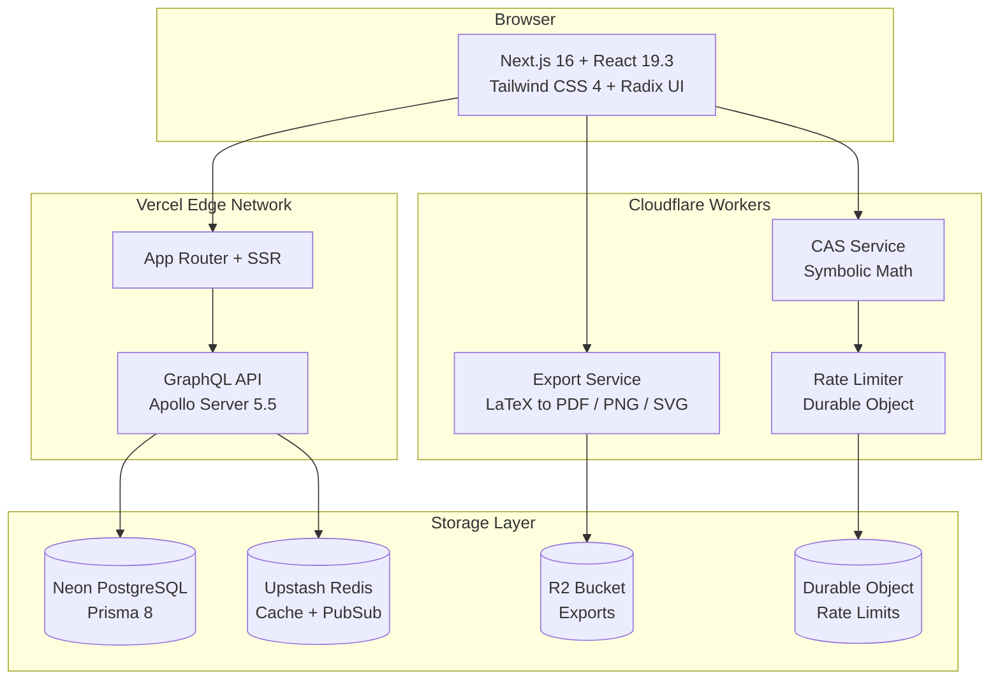

<div align="center">
  
</div>

<p align="center">
  
  
  
  
  
  
  
  
</p>

### What's New

> [!NOTE]
> **Current release: v1.5.2** — forum SSR now executes GraphQL in-process (no more "Post not found" streams), the admin profile renders its Architect tier, and the forum background became a compositor-only OKLCH aurora — on top of v1.5.1's hotfixes (avatars, comment upvotes, comment posting, Lorenz particles, ODE auto-fit, PDE 3D colormap) and the 2026-07 evergreen sweep. Full detail in [CHANGELOG.md](CHANGELOG.md).

> **Evergreen bump (2026-08-27, unreleased):** 63 dependency bumps landed post-v1.5.2 — Next.js 16.4 canary, TypeScript 7.1-dev (the native Go compiler now gates **all 10 packages**; the last two TS 6 holdouts migrated), Prisma 8.1 dev, Vitest 5 RC, pnpm 12 — with the full 4,550-test suite green.

<details>
<summary><strong>Highlights</strong></summary>

| Category | Improvements |
|:---------|:-------------|
| **Dependencies** | Next.js 16.4 canary, React 19.3 canary, TypeScript 7.1-dev native (all 10 packages), GraphQL 17, Apollo 5.5, Prisma 8.1 dev, Three.js 0.185-line, Biome 2.x, Turbo 2.10 canary, Vitest 5 RC, Wrangler 4.x, pnpm 12 |
| **Newest idioms** | TSL-compute Lorenz particles, GTAO SSAO, next-intl `useFormatter`, serwist 10, tagged-PDF export (modern-pdf-lib), modern-cmdk command palette |
| **Lint sweep** | Biome 2.x — 2,222 warnings + 221 infos → 0 warnings (real fixes; only documented, principled overrides) |
| **CI/CD** | Node 26, TypeScript 7 native typecheck gates all 10 packages (single job, no advisory track), gate green |

</details>

<h3 align="center">Scientific Calculator &amp; Mathematical Visualization Platform</h3>

<p align="center">
  49 pages &middot; 8 languages &middot; GPU-accelerated WebGL / WebGPU &middot; Edge computing
</p>

<p align="center">
  <a href="https://nextcalc.io"><strong>Live Demo</strong></a> &nbsp;&middot;&nbsp;
  <a href="#-quick-start">Quick Start</a> &nbsp;&middot;&nbsp;
  <a href="https://github.com/ABCrimson/NextCalc/wiki">Wiki</a> &nbsp;&middot;&nbsp;
  <a href="docs/ROADMAP.md">Roadmap</a>
</p>

<br />

---

## Highlights

<table>
<tr>
<td width="33%" valign="top">

**Scientific Calculator**
Full-featured calculator with expression history, LaTeX rendering, keyboard shortcuts, and statistical analysis panel.

</td>
<td width="33%" valign="top">

**2D / 3D Plotting**
GPU-accelerated function plotting with WebGL 2D, Three.js 3D surfaces, adaptive sampling, 9 colormaps, SSAO, and HDR cubemap themes.

</td>
<td width="33%" valign="top">

**Symbolic Math**
Computer algebra system with symbolic differentiation, integration (15+ rules), Taylor series, limits, and equation solving.

</td>
</tr>
<tr>
<td width="33%" valign="top">

**Algorithm Visualizations**
Interactive demos for Transformers, Zero-Knowledge Proofs, Quantum Computing, PageRank, Meta-Learning, and graph algorithms.

</td>
<td width="33%" valign="top">

**Edge Workers**
3 Cloudflare Workers for sub-50ms global symbolic math, LaTeX-to-PDF export, and rate limiting via a SQLite-backed Durable Object.

</td>
<td width="33%" valign="top">

**8 Languages**
Full i18n with 1,500+ keys per locale (1,609 in `en`): English, Russian, Spanish, Ukrainian, German, French, Japanese, Chinese.

</td>
</tr>
</table>

---

## Architecture


```mermaid
graph TB
    subgraph Client["Browser"]
        A["Next.js 16 + React 19.3<br/>Tailwind CSS 4 + Radix UI"]
    end

    subgraph Vercel["Vercel Edge Network"]
        B["App Router + SSR"]
        C["GraphQL API<br/>Apollo Server 5.5"]
    end

    subgraph Cloudflare["Cloudflare Workers"]
        D["CAS Service<br/>Symbolic Math"]
        E["Export Service<br/>LaTeX to PDF / PNG / SVG"]
        F["Rate Limiter<br/>Durable Object"]
    end

    subgraph Storage["Storage Layer"]
        G[("Neon PostgreSQL<br/>Prisma 8")]
        H[("Upstash Redis<br/>Cache + PubSub")]
        I[("R2 Bucket<br/>Exports")]
        J[("Durable Object<br/>Rate Limits")]
    end

    A --> B
    A --> D
    A --> E
    B --> C
    C --> G
    C --> H
    D --> F
    E --> I
    F --> J
```

---

## Tech Stack

| Category | Technology | Version |
|:---------|:-----------|:--------|
| Language | TypeScript | 7.1-dev native (all 10 packages) |
| Framework | Next.js | 16.4 canary |
| UI Library | React | 19.3 canary |
| Styling | Tailwind CSS | 4.3 |
| Components | Radix UI (unified) | 1.7 rc |
| Animation | Motion (`motion/react`) | 13.x |
| State | Zustand | 5.0 |
| Math | Math.js | 15.2 |
| 3D Rendering | Three.js | 0.185-line |
| LaTeX | KaTeX | 0.18 |
| ORM | Prisma | 8.1 dev |
| Auth | NextAuth + jose | 5.0 / 6.2 |
| GraphQL | Apollo Server / Client | 5.5 / 4.3 |
| GraphQL spec | graphql | 17 |
| Cache | Upstash Redis | 1.38 |
| Workers | Hono on Cloudflare | 4.13 |
| Build | Turborepo | 2.10 canary |
| Linting | Biome | 2.x |
| Testing | Vitest + Playwright | 5.0 rc / 1.63 alpha |

> Exact pinned versions live in each package's `package.json`.

---

## Project Structure

```
NextCalc/
├── apps/
│   ├── web/                   # Next.js 16 frontend (port 3005)
│   ├── api/                   # GraphQL API (Apollo Server 5.5)
│   └── workers/               # Cloudflare Workers
│       ├── cas-service/       #   Symbolic math on the edge
│       ├── export-service/    #   LaTeX to PDF/PNG/SVG export
│       └── rate-limiter/      #   API rate limiting via Durable Object
├── packages/
│   ├── math-engine/           # Core math library (23 subpath modules)
│   ├── plot-engine/           # GPU visualization engine
│   ├── database/              # Prisma 8 shared package
│   └── types/                 # Shared TypeScript types
└── docs/                      # Documentation
```

<details>
<summary><strong>apps/web</strong> — 49 page routes</summary>

```
app/[locale]/
├── algorithms/           # Algorithm hub + 10 sub-pages
│   ├── astar/            #   A* pathfinding
│   ├── crypto/           #   Cryptography (ZKP, differential privacy)
│   ├── dijkstra/         #   Dijkstra's shortest path
│   ├── graph-traversal/  #   BFS / DFS
│   ├── graphs/           #   Graph theory intro
│   ├── meta-learning/    #   MAML playground
│   ├── mst/              #   Minimum spanning tree
│   ├── pagerank/         #   PageRank with 3D spheres
│   ├── quantum/          #   Quantum computing sim
│   ├── transformers/     #   Transformer attention
│   └── zero-knowledge/   #   Zero-knowledge proofs
├── auth/signin/          # OAuth sign-in (GitHub, Google)
├── chaos/                # Lorenz attractor + bifurcation (WebGPU)
├── complex/              # Complex number operations
├── formulas/             # Formula library (70+ formulas)
├── forum/                # Community forum with GraphQL
├── fourier/              # Fourier analysis
├── game-theory/          # Nash equilibrium solver
├── gpu-lab/              # WebGPU simulation gallery
├── graphs-full/          # Full graph algorithm suite
├── learn/                # Interactive learning platform
├── matrix/               # Matrix operations
├── ml-algorithms/        # ML algorithm demos
├── pde/                  # PDE solver (heat, wave, Laplace) + 3D view
├── plot/                 # 2D/3D function plotter + relations + regression
├── practice/             # Practice problems + Infinite Drill
├── problems/             # Problem browser + number theory
├── profile/              # User profile
├── settings/             # User settings
├── share/[code]/         # Shared calculation pages
├── solver/               # Equation + ODE solver
├── stats/                # Statistics calculator
├── symbolic/taylor/      # Taylor series expansion
├── templates/            # Calculation templates
├── units/                # Unit converter
├── worksheet/            # Jupyter-like worksheet editor
└── worksheets/           # My Worksheets listing
```

</details>

<details>
<summary><strong>packages/math-engine</strong> — 23 subpath export modules (key modules shown)</summary>

| Module | Description |
|:-------|:------------|
| `parser/` | Expression parser + evaluator |
| `symbolic/` | Differentiation, integration, simplification, series, limits |
| `cas/` | Computer algebra system |
| `matrix/` | Matrix operations, eigenvalues, decompositions |
| `stats/` | Statistics, distributions, regression |
| `complex/` | Complex number arithmetic |
| `calculus/` | Vector calculus, line/surface integrals |
| `differential/` | Differential equations |
| `solver/` | Algebraic + ODE equation solver |
| `units/` | Unit conversion engine |
| `fourier/` | FFT, IFFT, spectral analysis, Fourier series |
| `graph-theory/` | Graph algorithms (Dijkstra, BFS, DFS, MST, PageRank) |
| `game-theory/` | Nash equilibrium, dominant strategies |
| `prover/` | Logic core + proof search |
| `algorithms/` | Sorting, searching, crypto, ML |
| `equivalence/` | CAS answer-equivalence grading (`checkEquivalence`) |
| `trace/` | StepTrace — structured step-by-step solution steps |

</details>

<details>
<summary><strong>packages/plot-engine</strong> — GPU rendering pipeline</summary>

- **WebGL 2D Renderer** — primary 2D backend with GLSL shaders
- **Three.js 3D Renderer** — surface plots, parametric curves, SSAO, HDR cubemaps
- **WebGPU Compute** — PDE/ODE solvers, bifurcation diagrams
- **Canvas 2D Fallback** — software renderer for legacy browsers
- **9 Colormaps** — viridis, inferno, magma, plasma, cividis, coolwarm, spectral, turbo, rainbow

</details>

---

## Quick Start

```bash
git clone https://github.com/ABCrimson/NextCalc.git
cd NextCalc
pnpm install
cp apps/web/.env.example apps/web/.env.local
# Edit .env.local with your credentials (see docs/SETUP.md)
pnpm dev
# Open http://localhost:3005
```

> **Prerequisites**: Node.js >= 24.0.0 (CI runs Node 26), pnpm >= 12

---

## Documentation

| Document | Description |
|:---------|:------------|
| **[DEVELOPMENT.md](DEVELOPMENT.md)** | Developer guide, commands, and conventions |
| **[docs/ARCHITECTURE.md](docs/ARCHITECTURE.md)** | System architecture and design decisions |
| **[docs/SETUP.md](docs/SETUP.md)** | Database (Neon) and OAuth (Google, GitHub) setup |
| **[docs/DEPLOYMENT.md](docs/DEPLOYMENT.md)** | Deployment guide for Vercel and Cloudflare |
| **[docs/ROADMAP.md](docs/ROADMAP.md)** | Feature roadmap and backlog |
| **[CHANGELOG.md](CHANGELOG.md)** | Version history |
| **[Wiki](https://github.com/ABCrimson/NextCalc/wiki)** | Full reference: API, math engine, database schema |

---

## Contributing

Contributions are welcome! Please read the [Contributing Guide](CONTRIBUTING.md) and our [Code of Conduct](CODE_OF_CONDUCT.md) before submitting a pull request.

---

## License

[MIT](LICENSE) &copy; 2025-2026 Albert Badalov
